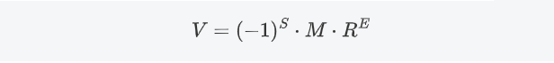
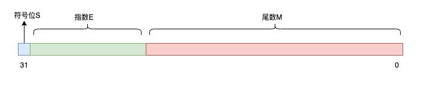

# C&C++

## 1.前言

`C`与`C++`是两种关系密切的语言，我们并非要将其分开学习，而是一起学习，因为C++更像是`C`语言的扩展一样。

`C`语言：面向过程语言（函数为主题，没有类的概念）

`C++`：面向过程、面向对象（函数、类的概念都有，面向对象以类位置主体）


**规范安全的好程序要从学习开始，写代码最重要的几点如下：**

- **对象判空**，你不能保证你拿到的东西不会是空的，因为大型的程序的编写会出现任何你想不到的错误
- **减少循环和递归**，循环比递归消耗性能小，递归需要额外的栈空间消耗，但循环也比较消耗性能，算法时间复杂度会说，但是不是说不能用循环和递归，只是说不能滥用
- **逻辑运算符两侧表达式的先后**，逻辑运算符有短路求值的特性，这意味着它们在求值时并不总是计算两侧的表达式，这种特性可以用来优化代码。
- **引用**，有效防止新变量的创建和调用拷贝构造函数
- **缓存**，将频繁需要范文的数据缓存下来，方便下次使用，其次可以减少对函数或者成员的访问时间，提高程序运行速度


上述适合所有程序开发，其次判断C和C++学没学到位的两个知识点分别为**指针**和**面向对象编程思想**，上述两个都学好了，恭喜初步入门。


**推荐入门的书籍**：

自己的`C++`编程基础书 `+`《C++Primer》《重构》


## 2.编辑器

学习一门编程语言需要写代码，所以需要准备一个代码编辑器，这里推荐`VS`或者`VScode`(`C++`环境安装会复杂点，推荐前者)。


### 2.1.程序执行

一个程序执行步骤：

新建解决方案💨创建项目💨编写代码💨编辑器语法检查（现在的`IDE`一般都是实时检查的）💨编译💨运行（不调试）💨报错💨调试（明显错误不需要，但隐藏错误需要调试）


### 2.2.调试热键

`Ctrl+F5`:立即运行

`F5`：调试（再次按是继续调试到此处，如回不到此处就继续运行了）

`F9`：打断点

`F10`：逐语句（每个句子逐一执行）

`F11`：逐过程（可以在调试函数时进入函数内部观察运行）


## 3.程序格式

`C`和`C++`的程序格式是有所不同的，但基本都是定式


### 3.1.代码格式

- `C`的格式：

```C
#include<stdio.h>//引用C语言标准输入输出库
//主函数入口（程序从此进入开始运行），一个项目只能有一个
int main()
{
    return 0;
}
```

- `C++`的格式

```cpp
#include<iostream>//引用C++的标准输入输出流
using namespace std;//引用命名空间（若此句省略，则输入和输出需要在前添加"std::",例如:"std::cin"进行输入）
int main()
{
    return 0;
}
```


### 3.2.文件后缀

`C`文件后缀：`.c`

`C++`文件后缀：`.cpp`（`C++` 被设计为与 `C` 语言高度兼容，`c`代码复制到`cpp`中一般不会有问题）

项目解决方案后缀：`.sln`


## 4.常量和变量

#### 4.1.常量

在程序中不可以改变的量，一般以值得形式存在，编译时就已经确定，并且在程序运行期间不会改变

例如：`3`	`'a'`	`3.5`	`"Hello, World!"`	`true`    宏定义内容


**宏定义**：

通过预处理器指令 `#define` 来定义的，没有类型，仅仅是文本替换，宏可以用于定义常量、函数宏等，不具备类型安全，它在编译时会被替换为其对应的值。

如下就是一个宏定义的`pai`

```cpp
#define PI 3.14159
```


##### 4.1.1.字面量

字面量是直接在代码中给出的值，而不是通过变量名或计算得到的。

例如：`3`	`'a'`	`3.5`  `"Hello, World!"`	`true`

字面量属于常量范畴，但常量不完全是字面量。

常量包括字面量、常量表达式、常量变量

- **常量表达式**：由字面量和运算符组成的表达式，其结果在编译时就可以确定，如 `2 * 3`、`'A' + 1` 等.
- **常量变量**：通过常量声明（如 `const` 关键字）修饰的变量，其值在初始化后不能改变，如 `const int MAX_VALUE = 100;`。


#### 4.2.变量

在程序中可以改变得量（必须先定义再使用）

##### 4.2.1.变量定义

```cpp
类型	变量名
```


##### 4.2.2.变量名

变量名必须是合法的标识符

合法的标识符必须满足

1. 由字母、数字、下划线组成
2. 开头只能是字母或者下划线
3. 不能是关键字


##### 4.2.3.命名注意事项

1. 区分大小写
2. 名字不宜太长（英文太长可以缩写）
3. 顾名思义
4. 格式统一（习惯变量小写就统一变量小写，具体看个人习惯）


## 5.基本数据类型

基本数据类型分为：整型、字符型、布尔型、浮点型

### 5.1.整型

#### 5.1.1.整型常量

整型常量的表达方式：10进制、8进制、16进制

- 10进制：每一位上的数为0-9
- 8进制：每一位上的数为0-7，且以0开头
- 16进制：每一位上的数为0-9、a-f(大小写都可以，且以`"0x"`数字零、字母`x`(大小写都行)开头）
- 2进制：机器语言，每一位上的数为0-1【一般没办法用字面量表示出来，其他语言有些是可以的，但C/C++这里不行】

**进制表示都是逢自己的进制时进一**


**进制英文名称**

| 进制   | 英文          |
| ------ | ------------- |
| 2进制  | `Binary`      |
| 8进制  | `Octal`       |
| 10进制 | `Decimal`     |
| 16进制 | `Hexadecimal` |

一些整型常量写法

`unsigned int`：`10u` 或 `10U`

`long`：`10l` 或 `10L`

`unsigned long`：`10ul` 或 `10UL`

`8`进制常量：012

`16`进制常量：`0xa` 或 `0Xa` 或 `0XA` 或 `0xA`

大小写都可以


#### 5.1.2.整数进制转换

整数是离散的、有限的数值，最终会得到一个完整的位数序列。


**10进制->n进制**：该数除以n求余数，商继续除以n求余数，直到商为0，余数反序写出就是结果。【除以n取余法】

**n进制->10进制**：从右往左，每一位上的数乘以n的m次方之和，m从0开始，依次+1【按权展开法】


**2进制->8进制**：从右往左，每3位二进制数转化为1位八进制数

**8进制->2进制**：从右往左，每1位八进制数转化为3位二进制数

**2进制->16进制**：从右往左，每4位二进制数转化为1位十六进制数

**16进制->2进制**：从右往左，每1位十六进制数转化为4位二进制数


#### 5.1.3.整型分类

**整型分为：**

`short`	存储大小为2个字节

`int`	存储大小为4个字节

`long`	存储大小为4个字节

`long long`	存储大小为8个字节


**补充**：位(`bit`)是计算机中最小的数据单位，表示一个二进制数字，可以是0或1，1个字节(byte)等于8位(`bit`)。


**类型修饰符：**

`signed`	有符号，默认情况下的类型都是省略这个修饰符的，例如`int`其实是`signed int`

`unsigned`	无符号

**注意**：有无符号并不会影响数据的存储大小，但会影响数据表示的范围。

因此可以随机组成，比如 无符号int型:`unsigned int`。


**`sizeof`运算符**

使用：

```cpp
sizeof(类型)
```

例如：

```cpp
// 获取 int 类型的大小，size_t是一个无符号整型
size_t size = sizeof(int);
```

记忆

拆分位`size`+`of`，即求类型的大小


**操作系统差异**

一般操作系统会影响数据存储的大小

window下

| 类型        | 16位操作系统 | 32位操作系统及以上 |
| ----------- | ------------ | ------------------ |
| `short`     | `2byte`      | `2byte`            |
| `int`       | `2byte`      | `4byte`            |
| `long`      | `4byte`      | `4byte`            |
| `long long` | 可能不支持   | `8byte`            |

特别注意`int`即可，因为其他基本都不会变，包括`char`、`float`、`double`


#### 5.1.4.整型表示范围

**数据存储**

计算机中数据是以**2进制补码**形式存储的，其中最高位表示符号位(0为正，1为负)，其他位表示大小


除了一些常用的，大家基本没人会去死背数据表示的范围，基本都是自己算的。

首先需要记住的数据为

`2^15 = 32768`
`2^16 = 65536`
`2^8=256`
`2^7=128`

上面的这些是基础，是你必须要记得的数据，因为非常常用。


**编码方式**

**原码**：最高位表示符号位，其他位表示大小

**反码**：正数反码与原码相同；负数符号位不变，按位取反

**补码**：正数补码和原码相同；负数为反码+1

**补码的补码就是原码**


**如何计算范围？**

我们以`short`为例子，`short`型占2个字节，因此是16位

则有（以下都是补码）

```cpp
最大数：0111 1111 1111 1111 等价于 2^15-1	32767
最小数：1000 0000 0000 0000 等价于 -2^15 	-32768
```

**解释：**

最大时有符号数必定是一个正数，所以符号位必定为0，其次想要最大，那必须每一位上都有数，所以全为1（正数补码与原码相同）

最小是必定是为负数的时候，所以符号位必定为1，但这里有些特殊，首先计算机中是以2进制补码来存数据的，这就意味着`"1000 0000 0000 0000"`的存在是合理的，但我们计算原码会得到`"1 1000 0000 0000 0000"` 

```cpp
补码：1000 0000 0000 0000
反码：1111 1111 1111 1111
原码：1 1000 0000 0000 0000
```

有同学会问为什么不是原码为`"1 1111 1111 1111 1111"`或者`"1111 1111 1111 1111"`最小呢？

没事我们来计算一下：

```
原码：1 1111 1111 1111 1111
反码：1 0000 0000 0000 0000
补码：1 0000 0000 0000 0001
这里看着没问题，但是我们的类型是short型，16位补码，这里明显超出一位

原码：1111 1111 1111 1111
反码：1000 0000 0000 0000 
补码：1000 0000 0000 0001
位数没问题，但是原码计算得出的值会小1
```

**记住带符号数最小值的特别点就行**

接下来，我们在计算无符号的`unsigned int` ，经过上面的例子下面这个就更加简单了

```
最大数：1111 1111 1111 1111 等价于 2^16-1	65535
最小数：0000 0000 0000 0000 等价于 0
```

无符号数都大于等于0，所以没有符号位，最高位也可以表示大小，最小那必定是0


#### 5.1.5.数据溢出

变量的值超出了数据类型的表示范围，经常发生在计算和转换类型的时候。


**那如何计算其经历数据溢出后的值呢？**

**大于数据类型所能表示的最大值**：

减去该数据类型表示范围的总数量（2^(位数)）的k倍（k>=1）

**小于数据类型所能表示的最小值**：

加上该数据类型表示范围的总数量（2^(位数)）的k倍（k>=1）


**为什么是这样？原理是什么？**

原理是数据范围可以看作是一个小周期，即类似一个周期函数，用`char`举例

`char`的数据范围为`-128`到`127`，一个周期为`256`，如下：

```cpp
char x = 257;
cout <<(int)x<< endl;//输出：1
```

```
原码：01 0000 0001
反码：01 0000 0001
补码：01 0000 0001

从低位往高位截断8位
计算机中该类型补码为0000 0001
符号位为0，因此为1，这里加(int)强转是为了将结果显示出来，后面会讲为什么能显示全
```

这里`x`已经超出`127`了，但是`8`位`2`进制数表示`256`个数，溢出的数必定在`8`位往上，从右往左（低位到高位）截断就是计算机中存储的补码数据，很明显的就是`8`位往上的任何位都是后`8`位所能表示数据的整数倍，因此才说可以看作周期。


#### 5.1.6.整型定义规范

1. 尽量节约内存（不要太大，也不要太小，选择能满足需求的）
2. 避免数据溢出
3. 有无符号


### 5.2.字符型

既可以表示小整数，也可以表示字符

#### 5.2.1.字符型常量

`''`：用单引号的是字符，如`'a'`

`""`：用双引号的是字符串，如`"abc"`


**字符常量**：

例如：`'a'`	`'0'`


**转义字符**

转义字符通常以反斜杠（`\`）开头，后跟一个或多个字符，表示一个特定的字符或控制序列。

例如：`'\n'`	`'\123'`	`'\x12'`


**常见的转义字符**

| 转义字符  | 描述                                                         |
| --------- | ------------------------------------------------------------ |
| `\0`      | 空字符，字符串常量系统默认以`'\0'`结尾，表示字符串的结束，ASCII值为0 |
| `\n`      | 换行                                                         |
| `\t`      | 制表符                                                       |
| `\"`      | 双引号                                                       |
| `\'`      | 单引号                                                       |
| `\\`      | \ 字符                                                       |
| `\?`      | ?字符                                                        |
| `\ooo`    | 一到三位的八进制数                                           |
| `\xhh...` | 一个或多个数字的十六进制数                                   |
| `\a`      | 警报铃声                                                     |
| `\b`      | 退格键                                                       |
| `\f`      | 换页符                                                       |
| `\r`      | 回车                                                         |
| `\v`      | 垂直制表符                                                   |


**8进制字符**

如：`'\123'`

后面接的数最多3位，可以调整、且自己会断开

**16进制字符**

如：`'\x12'`

可以接的数没有位数要求，不会自己断开


**特别注意**，无论是`8`进制字符还是`16`进制字符的值都是正的且不可能大于`255`，因为无符号`char`类型只占一个字节，其范围为`0-255`（字符串中的进制字符，只表示编码不涉及符号）

例，下列字符串长度计算会让你明白上面所说

```cpp
"\94" 占3个字节
'\'被省略了，因为9不是8进制数，9和4各占一个字节，'\0'为字符串字面量结尾（你看不见），它也占一个字节，所以3个字节

"\377" 占2个字节
'\377'这是一个8进制字符，占一个字节，再加上'\0'一共2个字节

"\378" 占3个字节
'\378'如果为8进制字符的话，求得其值为256，超出无符号char的表示范围了，因此断开8，再次计算满足八进制数，所以'\37','8','\0'一共3个字节
    
"\012" 占2个字节
'\012'是一个8进制字符，加上'\0'，结果为2字节 
    
"\091" 占4个字节
'\091'不是一个8进制字符，因为9不是8进制数，因此从9拆开，分别为'\0','9','1','\0'，结果为4个字节
    
"\xff"
'\xff'计算得这是一个16进制字符，其值为255，因此结果为2个字节  
    
"\x000…0ff" …：省略不知道多少个0	占2个字节
'\x000…0ff'计算得这是一个16进制字符，其值为255，因此结果也为2个字节     
```


### 5.3.布尔型

`bool`占一个字节，表示范围为`0-1`

**布尔常量**：`true`(1)  和 `false`(0)

在`C/C++`中一切非0皆为真


### 5.4.浮点型

#### 5.4.1.浮点型常量

**小数形式**：如，`3.4`

**指数形式**：如，`3.2e-2`等价于3.2*10^(-2)

说明一下指数形式应该怎么写，

```cpp
一般形式（生活中写法）	a*10^b 
其中a是基数，b是指数，指数必须是整数
	
编程语言	aeb 或者 aEb 
e大写小写都可以
```

举几个例子：

```

1.23e4 表示 1.23 * 10^4，即12300。

1.23e+4 表示 1.23 * 10^4，即12300。
正号可以省略

1.23e-4 表示 1.23 * 10^-4，即0.000123。
```


一些浮点型常量写法

单精度常量(`float`)：`1.2f` 或  `1.2F`

双进度常量(`double`)：`1.2` 

`long double`常量：`1.2l` 或 `1.2L`

字母可大写可小写


#### 5.4.2.浮点型分类

**浮点型分为：**

`float`	存储大小为4个字节，精度为`6`位

`double`	存储大小为8个字节，精度为`15-16`位

`long double`	存储大小为16个字节，精度为`18-21`位

`long double`精度还是得看平台的，不过没关系，你只需要知道它能表示很多小数就行。


#### 5.4.3.浮点数进制转换

小数是连续的、可能无限的数值，其转换过程可能永远不会终止，因为有些小数在转换为其他进制时会变成无限循环小数，因此转换过程通常在达到所需的精度或遇到循环小数时终止。


**浮点数的进制转换通常将整数部分和小数部分分开进行计算。**

这里属于计算机组成原理的知识，它也是程序必须懂的东西。


**对小数而言：**

**10进制->n进制**：该数乘以n取整，小数继续乘以n取整，一直乘下去，直到小数部分为0或达到所需的精度，正序将取整的数列出来，作为小数部分即可【乘以n取整法】

**n进制->10进制**：以整数的最低位为基准(各位)，每一位上的数乘以n的m次方之和，m以基准向左+1，向右-1【按权展开法】


浮点数用科学计数法表示格式如下：



`S`：**符号位**，0 表示正数，1 表示负数
`M`：**尾数**，用小数表示，例如`1.2310^5`，`1.23`就是尾数
`R`：**基数**，表示`n`进制数，则 `R` 就是 `n`，例如 表示2进制数则 `R` 就是 2
`E`：**指数**，用整数表示，例如 `1.2310^5`，`5`就是指数


浮点数的二进制表示遵循 **IEEE 754** 标准

其存储结构如图所示：



- 单精度浮点数（`float`，`32`位）
	- **符号位（S）**：1位
	- **指数位（E）**：8位，用于表示数值的指数部分。指数采用偏移量（bias）表示法，偏移量为127。实际指数值为指数位的值减去偏移量.
	- **尾数位（M）**：23位，用于表示数值的有效数字部分。尾数部分采用隐含整数部分为1的表示法，即实际尾数为1加上尾数位的值.
- 双精度浮点数（`double`，`64`位）
	- **符号位（S）**：1位，用于表示数值的符号。0表示正数，1表示负数.
	- **指数位（E）**：11位，用于表示数值的指数部分。指数采用偏移量表示法，偏移量为1023。实际指数值为指数位的值减去偏移量.
	- **尾数位（M）**：52位，用于表示数值的有效数字部分。尾数部分采用隐含整数部分为1的表示法，即实际尾数为1加上尾数位的值.

`long double` 的大小和精度是平台依赖的所以不写，知道位数其实和`float`、`double`一样处理


**特殊约定**
为了让其表示范围、精度最大化，还对指数和尾数做了如下规定：

- 因为尾数 M 的第一位总是 1（因为 1 <= M < 2），因此这个 1 可以省略不写，它是个隐藏位，这样单精度 23 位尾数可以表示 24 位有效数字，双精度 52 位尾数可以表示 53 位有效数字。

- 因为指数 E 是个「无符号」整数，但因为指数可以是负的，所以规定如下：

	表示 `float` 时，一共占 8 bit 的取值范围为 `0 ~ 255`。 在存入 E 时在它原本的值「加上一个中间数 127」， 这样 E 的取值范围为 `-127 ~ 128`。

	表示`double`时，一共占 11 bit 的取值范围为 `0 ~ 2047`，在存入 E 时在它原本的值「加上一个中间数 1023」，这样 E 的取值范围为 `-1023 ~ 1024`。

- 规定边界条件如下：

	`若指数 E 非全 0 且非全 1`：规格化数字，尾数隐藏位是 1(`1.M`)
	`若指数 E 全 0，尾数非 0`：非规格化数，尾数隐藏位不再是 1，而是 0(`M = 0.xxxxx`)，这样可以表示 0 和很小的数
	`若指数 E 全 1，尾数全 0`：正无穷大/负无穷大（正负取决于 S 符号位）
	`若指数 E 全 1，尾数非 0`：`NaN`(`Not a Number`)，`NaN`用于表示某些未定义或不可表示的值，如0/0或无穷大-无穷大等

	

以`float`为例，将10进制数`123.625`转化为2进制数

```cpp
整数123转2进制	除以2取余
    2|123……1
    2|61……1
    2|30……0
    2|15……1
    2|7……1
    2|3……1
    2|1……1
      0
整数部分的二进制数为1111011
    
小数0.625转2进制	   乘2取整法
    0.625*2 = 1.25  1
     0.25*2 = 0.5   0
      0.5*2 = 1.0   1
小数部分的二进制数为101
组合整数和小数部分：1111011.101
符号位S=0
指数E=10000101  实际指数为6，因为组合的数可以写成1.111011101*2^6，又因为E用的是偏移量计算的，因此6+127=133，转化为2进制就是10000101
尾数M=1110 1110 1000 0000 0000 000   组合的数科学计数法表示1.111011101*2^6，即去掉1，所以尾数为111011101,后面补0直到23位。
    

所以该浮点数在内存中如下所存
 S |     E    |      M
 0  1000 0101   1110 1110 1000 0000 0000 000 
```

根据上述其实也能了解到：

1. 指数位越多，则尾数位越少：则其表示的范围越大，但精度也越差。
2. 指数位越少，则尾数位越多：则其表示的范围越小，但精度也会变好。


### 5.5.习题

